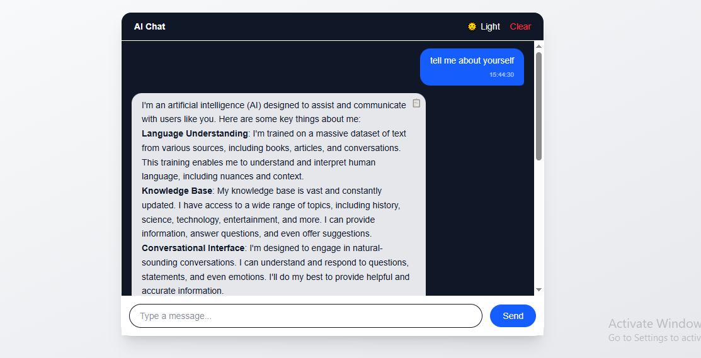

# AI Chatbot – Real-Time Streaming Chat Application

## Project Description
This project is a real-time AI chatbot built using Next.js and Socket.IO.  
It allows users to send messages and receive AI-generated responses that stream token-by-token, similar to modern AI chat interfaces.  
The focus of this assignment was correctness, clean architecture, and user experience.




## Setup Instructions (Step-by-Step)

1. **Clone the repository**
   ```bash
   git clone https://github.com/coolshubhamsharma/AI-Chatbot.git
   cd AI-Chatbot
   ```

2. **Install dependencies**
   ```bash
   npm install
   ```

3. **Create environment file**
   Create a `.env.local` file in the root directory.

4. **Add required environment variables** (see below)

5. **Run the development server**
   ```bash
   npm run dev
   ```

6. Open browser and visit:
   ```
   http://localhost:3000
   ```

---

## Environment Variables

Create a `.env` file with the following:

```env
GROQ_API_KEY=your_groq_api_key_here
```

> The API key is required to communicate with the Groq LLM service.

---

## Commands to Run the Project

| Command | Description |
|------|------------|
| `npm install` | Install dependencies |
| `npm run dev` | Start development server |
| `npm run build` | Build for production |
| `npm run start` | Run production build |

---

## Tech Stack & Libraries Used

### Frontend
- **Next.js (App Router)**
- **React**
- **TypeScript**
- **Tailwind CSS**
- **Framer Motion** (UI animations)
- **react-markdown** (Markdown rendering)

### Backend / Realtime
- **Socket.IO**
- **Next.js API Routes**
- **Groq SDK** (LLM streaming)

### Utilities
- **LocalStorage** (message persistence)

---

## Features Implemented

- Real-time AI response streaming
- WebSocket-based communication (Socket.IO)
- Message persistence using localStorage
- Clear chat functionality
- Copy message to clipboard with visual feedback
- Markdown rendering for AI responses
- Typing indicator animation
- Auto-scroll to latest message
- Dark / Light theme toggle
- Responsive and clean UI

---

## Time Spent on Assignment

**Approx. 8-10 hours**, including:
- Architecture setup
- Debugging streaming edge cases
- Socket.IO lifecycle handling
- UI/UX polish
- Bonus feature implementation

---

## Demo Video

 **Demo Video Link:**  
```
<add-your-demo-video-link-here>
```

---

## Notes

- Streaming is handled carefully to avoid truncation issues.
- Token buffering is used to ensure complete AI responses.
- Code is kept simple, readable, and well-commented.


